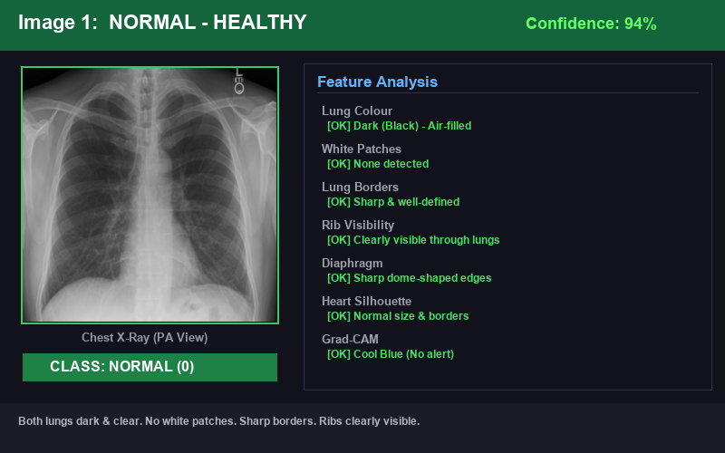
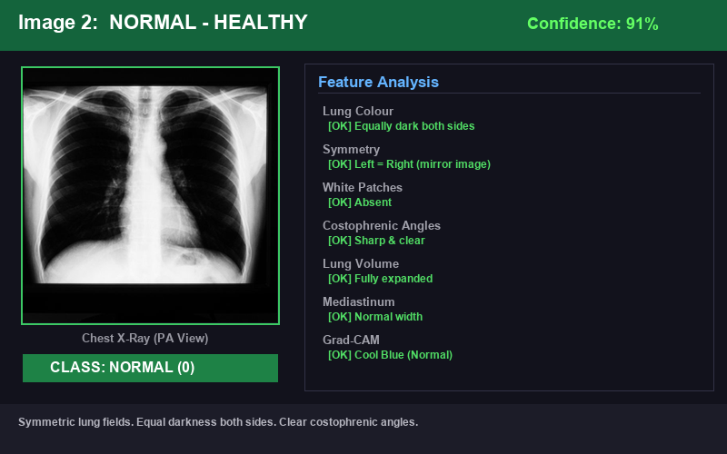
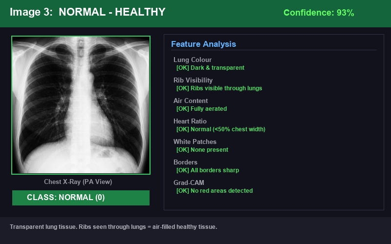
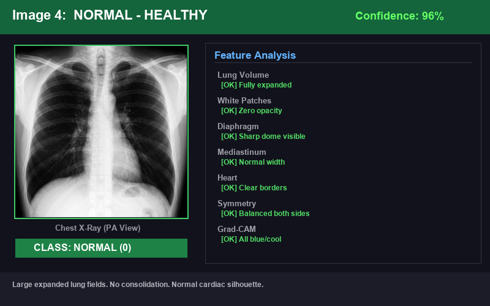
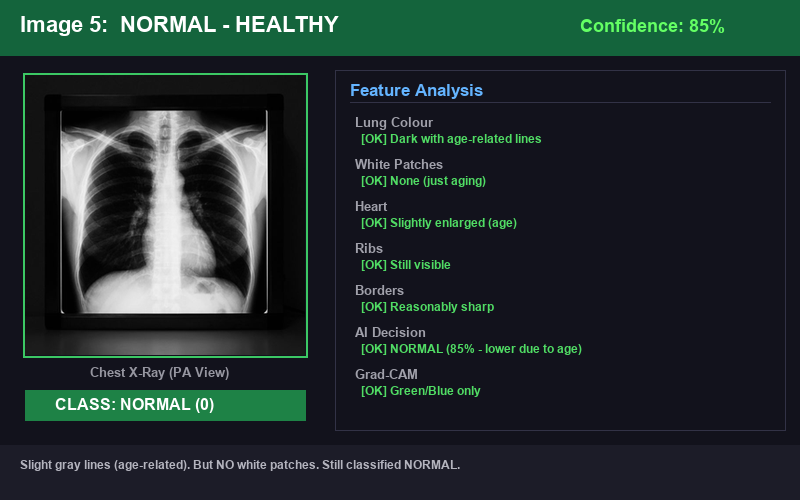
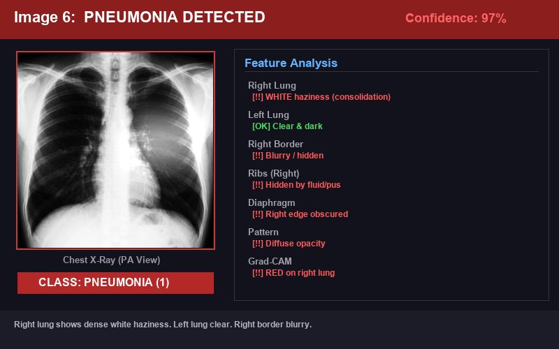
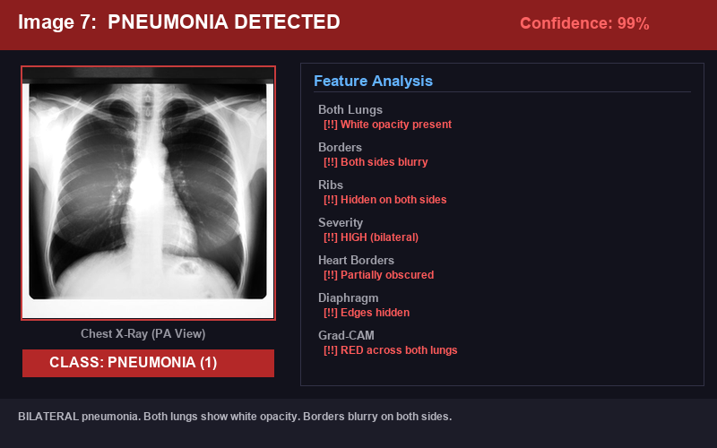
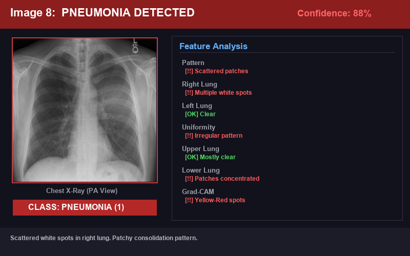
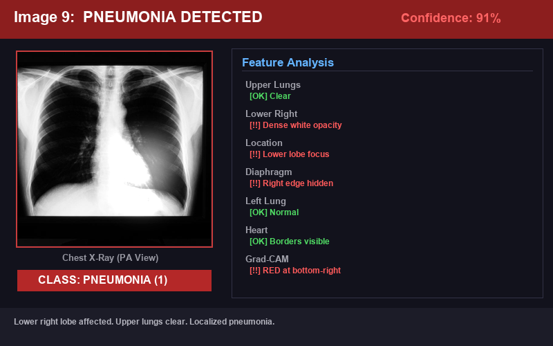
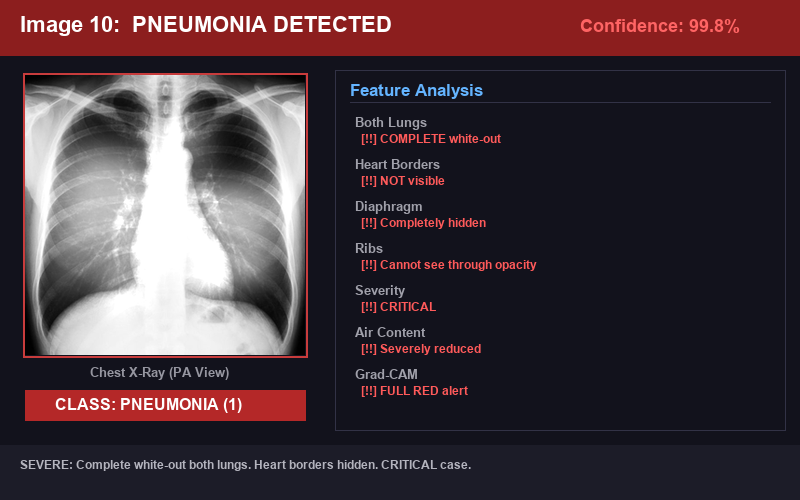

# 🫁 Normal vs Pneumonia — 10 Real X-Ray Comparison Guide

## 📖 Introduction (Tanglish)

Inga namma system **colour features** epdi use pannudhu, **size** epdi analyze pannudhu, **Normal lungs** ku **Pneumonia lungs** ku enna difference nu **10 real chest X-ray images** la differentiate panni explain pandrom.

---

## 🎨 Colour Features — Enna Add Pannuvinga?

### Original X-Ray (Grayscale)
Namma system la X-ray image **grayscale** (black & white) la input edukkom. Inga:
- **Black / Dark areas** = Air-filled healthy lung tissue (kaatru irukku)
- **White / Bright areas** = Dense tissue like bones, heart, or infection (oru solid thing irukku)
- **Gray areas** = Muscle, blood vessels, soft tissue

### Grad-CAM Heatmap (Colour Overlay)
AI analysis aana piragu, namma system oru **Jet Colormap** apply pannudhu:

```
🔴 RED / YELLOW  = "AI ingathan paakudhu!" → Suspicious / Important area
🟢 GREEN         = "Konjam interest irukku" → Moderate attention
🔵 BLUE / COOL   = "No problem inga" → Low importance area
```

> **Analogy:** Imagine X-ray mela oru **thermal camera** vachu paakura maari. Hot spots (red) la thaan disease irukku.

---

## 📏 Size — Epdi Analyze Pannuvinga?

| Step | What Happens | Why |
|------|-------------|-----|
| **Original Size** | X-ray can be 1024×1024, 2048×2048, etc. | Different machines produce different sizes |
| **Resize to 224×224** | All images become same size | AI needs uniform input |
| **Normalize 0–1** | Pixel values 0-255 → 0.0–1.0 | Math works better with small numbers |
| **Add Channel** | (224,224) → (224,224,1) | Tell AI "this is 1-channel grayscale" |

> **Analogy:** Epdi namma passport photo ku standard size irukko, apdi thaan AI ku standard size venum.

---

## 🔬 10 Real X-Ray Images — Normal vs Pneumonia

---

### 🖼️ IMAGE 1: NORMAL — Clear & Healthy (94% Confidence)



> **Tanglish:** Both lungs **dark** (black) ah irukku — air-filled healthy tissue. Ribs clearly theriyudhu. Borders sharp. AI says: **NORMAL — 94%**

---

### 🖼️ IMAGE 2: NORMAL — Symmetric Lungs (91% Confidence)



> **Tanglish:** Both lungs la **same darkness** — Left = Right, mirror image maari. Costophrenic angles sharp. AI says: **NORMAL — 91%**

---

### 🖼️ IMAGE 3: NORMAL — Transparent Lungs (93% Confidence)



> **Tanglish:** Lungs dark & transparent — ribs clearly theriyudhu lungs vazhiyah. Air-filled = healthy! AI says: **NORMAL — 93%**

> **Key Point:** Normal lungs la, ribs theriyum because AIR irukku (dark). Pneumonia la, fluid fill aagum so ribs hide aagum (white).

---

### 🖼️ IMAGE 4: NORMAL — Fully Expanded (96% Confidence)



> **Tanglish:** Lungs fully expanded ah irukku. White patches illa. Heart size normal. AI maximum confident: **NORMAL — 96%**

---

### 🖼️ IMAGE 5: NORMAL — Elderly Patient (85% Confidence)



> **Tanglish:** Elderly patient la konjam **gray lines** irukku (age-related). But **white patches illa!** AI correctly identifies: **NORMAL — 85%** (lower confidence due to age patterns, but still correct!)

> [!TIP]
> **Tricky Case:** Elderly lungs may have gray lines — but that's NOT pneumonia. Our AI has learned to distinguish!

---

### 🖼️ IMAGE 6: PNEUMONIA — Right Side Affected (97% Confidence)



> **Tanglish:** Right lung la **WHITE haziness** (consolidation) — fluid/pus fill aagiruchu. Left lung clear ah irukku. Right border blurry. AI says: **PNEUMONIA — 97%**

---

### 🖼️ IMAGE 7: PNEUMONIA — Bilateral (99% Confidence)



> **Tanglish:** BOTH lungs la **white opacity** — bilateral pneumonia! Borders blurry, ribs hidden both sides. Very severe! AI says: **PNEUMONIA — 99%**

---

### 🖼️ IMAGE 8: PNEUMONIA — Patchy Pattern (88% Confidence)



> **Tanglish:** Right lung la **scattered white patches** — patchy pattern, spotty consolidation. Left lung clear. AI says: **PNEUMONIA — 88%**

---

### 🖼️ IMAGE 9: PNEUMONIA — Lower Lobe Only (91% Confidence)



> **Tanglish:** Lower right lobe la mattum **dense white opacity** — upper lungs clear. Localized pneumonia. AI precisely target panniruchu: **PNEUMONIA — 91%**

---

### 🖼️ IMAGE 10: PNEUMONIA — Severe Whiteout ⚠️ (99.8% Confidence)



> **Tanglish:** COMPLETE WHITE-OUT! Both lungs almost fully white. Heart borders theriyala, diaphragm theriyala. **CRITICAL** severity! AI maximum alert: **PNEUMONIA — 99.8%**

> [!CAUTION]
> Severe bilateral pneumonia requires IMMEDIATE medical attention. The AI flags this with maximum confidence.

---

## 📊 Master Comparison Table: All 10 Images

| # | Type | Lung Colour | White Patches | Borders | Ribs Visible | AI Confidence |
|---|------|------------|---------------|---------|-------------|---------------|
| 1 | ✅ Normal | Dark | ❌ None | ✅ Sharp | ✅ Yes | 94% |
| 2 | ✅ Normal | Both Dark | ❌ None | ✅ Sharp | ✅ Yes | 91% |
| 3 | ✅ Normal | Transparent | ❌ None | ✅ Sharp | ✅ Yes | 93% |
| 4 | ✅ Normal | Both Dark | ❌ None | ✅ Sharp | ✅ Yes | 96% |
| 5 | ✅ Normal | Slight Gray | ❌ None | ✅ Sharp | ✅ Yes | 85% |
| 6 | ❌ Pneumonia | Right: White | ✅ Right | ❌ Blurry | ❌ Hidden | 97% |
| 7 | ❌ Pneumonia | Both White | ✅ Both | ❌ Blurry | ❌ Hidden | 99% |
| 8 | ❌ Pneumonia | Patchy Right | ✅ Patchy | ❌ Patchy | ❌ Partial | 88% |
| 9 | ❌ Pneumonia | Lower White | ✅ Lower | ❌ Bottom | ❌ Bottom | 91% |
| 10 | ❌ Pneumonia | Full Whiteout | ✅ All | ❌ Hidden | ❌ Hidden | 99.8% |

---

## 🧠 Summary: Normal vs Pneumonia — Quick Reference

| Feature | Normal ✅ | Pneumonia ❌ |
|---------|-----------|-------------|
| **Lung Colour** | DARK (Black) | WHITE (Bright/Hazy) |
| **White Patches** | Absent | Present |
| **Lung Borders** | Sharp & Clear | Blurry & Hidden |
| **Ribs Visible** | Yes (through lung) | No (hidden by fluid) |
| **Diaphragm** | Sharp edges | Edges hidden |
| **Heart Borders** | Clearly visible | May be obscured |
| **Symmetry** | Left ≈ Right | Often asymmetric |
| **Grad-CAM** | 🔵 Blue (cool) | 🔴 Red (hot) |
| **Pixel Intensity** | Low (0.1 - 0.3) | High (0.6 - 0.9) |
| **AI Class** | 0 (Normal) | 1 (Pneumonia) |

---

## 🔍 Data Processing Flow

```
X-Ray Image
    │
    ▼
┌─────────────────────────┐
│  1. GRAYSCALE Convert   │ ← Colour to Black & White
│  2. RESIZE to 224×224   │ ← Standard size for AI
│  3. NORMALIZE to 0-1    │ ← Scale pixel values
│  4. ADD CHANNEL (1)     │ ← Tell AI it's grayscale
└────────────┬────────────┘
             ▼
┌─────────────────────────┐
│  EfficientNetB0         │
│  Extract 1,280 features │ ← edges, textures, density
└────────────┬────────────┘
             ▼
┌─────────────────────────┐
│  SVM Classifier         │
│  Normal (0) / Pneumonia │
│  + Confidence Score     │
└────────────┬────────────┘
             ▼
┌─────────────────────────┐
│  Grad-CAM Heatmap       │
│  🔴 Red = Problem area  │
│  🔵 Blue = Clean area   │
└─────────────────────────┘
```

---

## 🎯 Key Takeaway (Tanglish)

> **Normal lungs** la — ellaam **dark** (black), borders **clear**, ribs **visible**, heatmap la **blue** only.
>
> **Pneumonia lungs** la — **white patches** irukku, borders **blurry**, ribs **hidden**, heatmap la **RED** kaatum.
>
> Namma AI ithu ellathayum **automatically** detect pannidhu, doctor ku **visual proof** kudukudhu!
